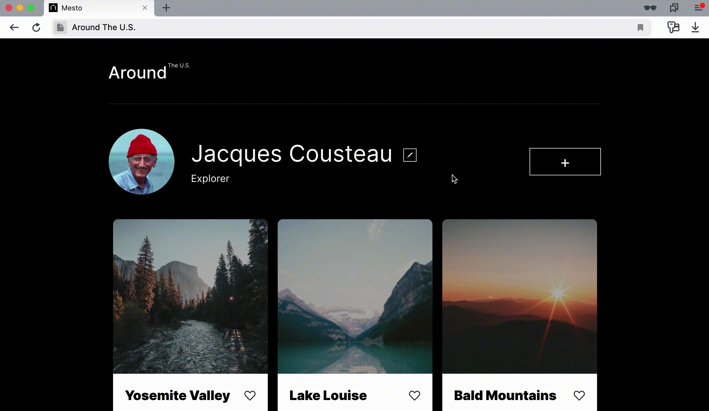

# Proyecto Web Project Around React (Sprint 14)

## 🧠 Descripción general

Este proyecto es la evolución del Sprint 12 de **Web Interactiva con POO y JavaScript Asíncrono**, migrado y reescrito con **Vite + React** para aprovechar las ventajas de un framework moderno y una herramienta de bundling rápida.

La aplicación permite gestionar tarjetas de usuario con información, imágenes y funcionalidades como "like", edición, eliminación y visualización en popups. Además, se conecta con una **API REST externa real** para persistir datos, lo cual representa un paso importante en la preparación para proyectos profesionales.

---

## 🆕 Novedades del Sprint 14

- 🔌 **Conexión real con API REST externa** (`fetch` desde clase `Api` modular).
- ⚙️ **Cliente API centralizado**: gestión clara de endpoints (`getUserInfo`, `addCard`, `changeLikeCardStatus`, etc.).
- 💾 **Persistencia remota de datos de usuario y tarjetas**.
- 🔄 **Unificación de lógica para "like/unlike"** mediante `changeLikeCardStatus`.
- ⚛️ **Preparación para React avanzado**: introducción a `Context`, `React Router` y `State Management`.
- 🧠 **Programación en pizarra**: preparación para entrevistas técnicas con ejercicios clave.
- 🚀 **Vite + React** conectado correctamente a la API remota.

---

## ⚙️ Tecnologías usadas

| Herramienta            | Descripción                                                |
| ---------------------- | ---------------------------------------------------------- |
| **React**              | Librería declarativa para construir UI componible          |
| **Vite**               | Bundler moderno para desarrollo rápido con React           |
| **React Router DOM**   | Navegación estructurada entre vistas (en progreso)         |
| **Context API**        | Manejo de estado global del usuario (preparación avanzada) |
| **JavaScript (ES6+)**  | Lógica, promesas, módulos, async/await                     |
| **CSS Modular + BEM**  | Estilizado escalable y reutilizable                        |
| **API REST externa**   | Conexión real con backend (usuarios, tarjetas, avatar)     |
| **Git + GitHub Pages** | Control de versiones, despliegue y colaboración            |

---

## 📸 Vista Previa



---

## 📁 Estructura del Proyecto

```plaintext
public/
├── vite.svg
└── images/
    ├── Addbutton.png
    ├── Avatar.jpg
    ├── baldmountains.jpg
    ├── Closeicon.svg
    ├── Editbutton.png
    ├── lake.jpg
    ├── lagobraies.jpg
    ├── latemar.jpg
    ├── logoaround.png
    ├── moved_project-4-01-eng.gif
    ├── Trash.png
    ├── Union.svg
    ├── Vector.svg
    ├── vanoise.jpg
    └── yosemite.jpg

src/
├── index.css             # Estilos globales
├── main.jsx              # Punto de entrada de React
│
├── assets/
│   └── react.svg         # Recursos estáticos
│
├── components/
│   ├── App.jsx           # Componente principal
│   │
│   ├── Footer/
│   │   └── Footer.jsx
│   │
│   ├── Header/
│   │   └── Header.jsx
│   │
│   ├── ImagePopup/
│   │   └── ImagePopup.jsx
│   │
│   └── Main/
│       ├── Main.jsx
│       │
│       ├── components/
│       │   ├── Card/
│       │   │   └── Card.jsx
│       │   │
│       │   ├── ImagePopup/
│       │   │   └── ImagePopup.jsx
│       │   │
│       │   └── Popup/
│       │       └── Popup.jsx
│       │
│       └── form/
│           ├── EditAvatar/
│           │   └── EditAvatar.jsx
│           │
│           ├── EditProfile/
│           │   └── EditProfile.jsx
│           │
│           └── NewCard/
│               └── NewCard.jsx

vendor/
├── normalize.css         # Reset de estilos
└── fonts/
    ├── fonts.css
    ├── Inter-Bold.woff2
    ├── Inter-Regular.woff2
    ├── Inter-SemiBold.woff2
    └── .DS_Store (puede eliminarse)

```

## Funcionalidades principales

- Visualización de tarjetas con nombre, imagen y descripción.
- Añadir, editar o eliminar tarjetas mediante formularios.
- Actualizar el perfil del usuario y el avatar.
- Likes funcionales que se reflejan en la API.
- Popups accesibles: cierre con clic fuera, botón o tecla Escape.
- Uso de React Hooks (useState, useEffect) para manejar estado y efectos.
- Estructura modular y mantenible de componentes.
- Peticiones reales al servidor con fetch (GET, POST, PATCH, DELETE).
- Arquitectura limpia: separación de lógica de red, UI y estado.

## Scripts disponibles

Desde la carpeta raíz del proyecto, puedes ejecutar:

| Comando           | Descripción                                              |
| ----------------- | -------------------------------------------------------- |
| `npm install`     | Instala las dependencias del proyecto                    |
| `npm run dev`     | Inicia el servidor de desarrollo con recarga en caliente |
| `npm run build`   | Construye la aplicación para producción                  |
| `npm run preview` | Previsualiza localmente la versión de producción         |

## Funcionalidades principales

- Visualización de tarjetas con nombre, imagen y descripción.
- Añadir, editar o eliminar tarjetas mediante formularios.
- Actualizar el perfil del usuario y el avatar.
- Likes funcionales que se reflejan en la API.
- Popups accesibles: cierre con clic fuera, botón o tecla Escape.
- Uso de React Hooks (useState, useEffect) para manejar estado y efectos.
- Estructura modular y mantenible de componentes.
- Peticiones reales al servidor con fetch (GET, POST, PATCH, DELETE).
- Arquitectura limpia: separación de lógica de red, UI y estado.

## 📡 Clase Api.js (resumen)

class Api {
constructor({ baseUrl, headers }) { ... }

getUserInfo() { ... }
getInitialCards() { ... }
updateUserInfo(data) { ... }
addCard(data) { ... }
deleteCard(cardId) { ... }
changeLikeCardStatus(cardId, isLiked) { ... }
updateAvatar(data) { ... }
}

👉 Define una instancia api exportada, conectada a:
https://around-api.es.tripleten-services.com/v1

## 🤝 Cómo contribuir

- Clona el repositorio.
- Instala dependencias con npm install.
- Crea una rama para tu feature o fix: git checkout -b mi-rama.
- Realiza tus cambios.
- Haz commit y push.
- Abre un Pull Request para revisión.

🌐 Ver el proyecto en línea:
👉 https://carlosduro.github.io/web_project_around_react/
